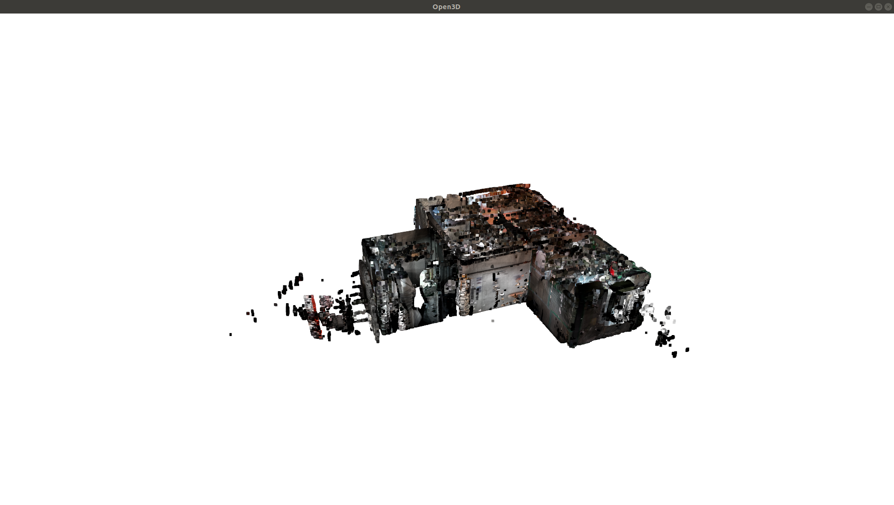
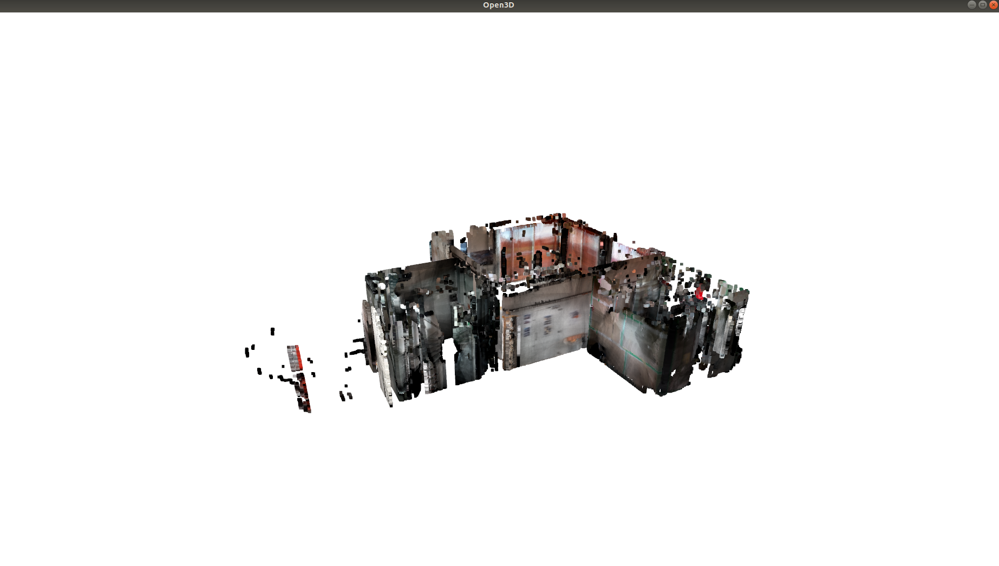
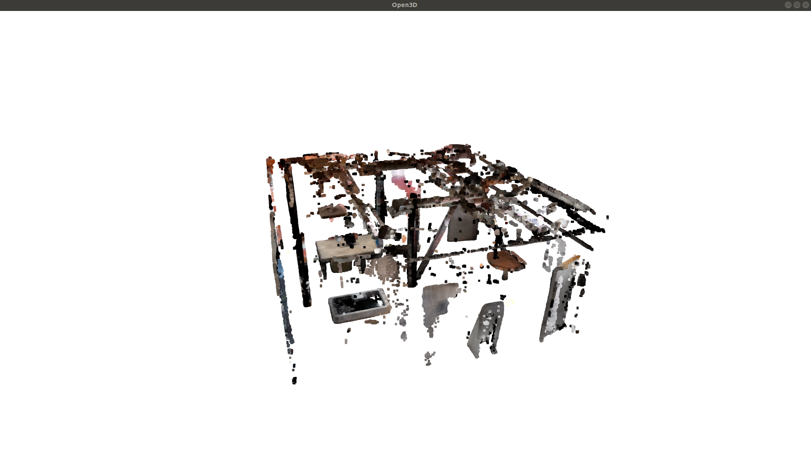
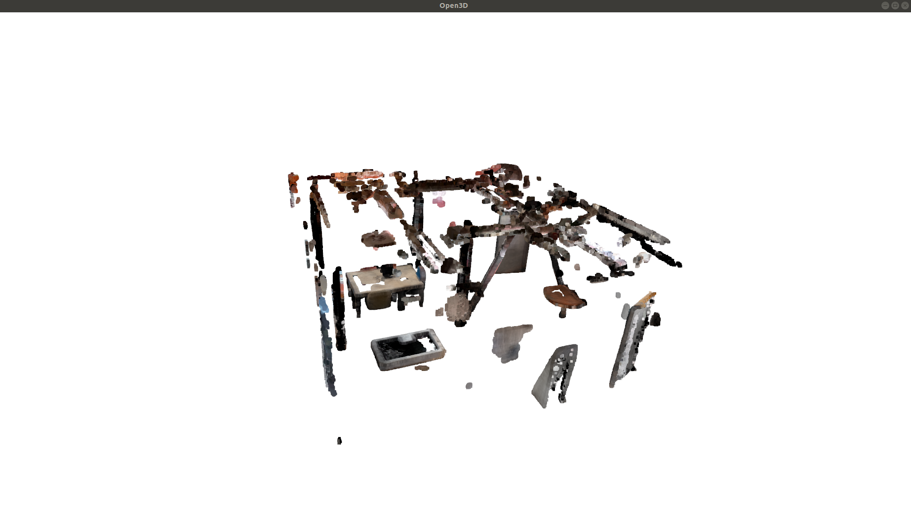
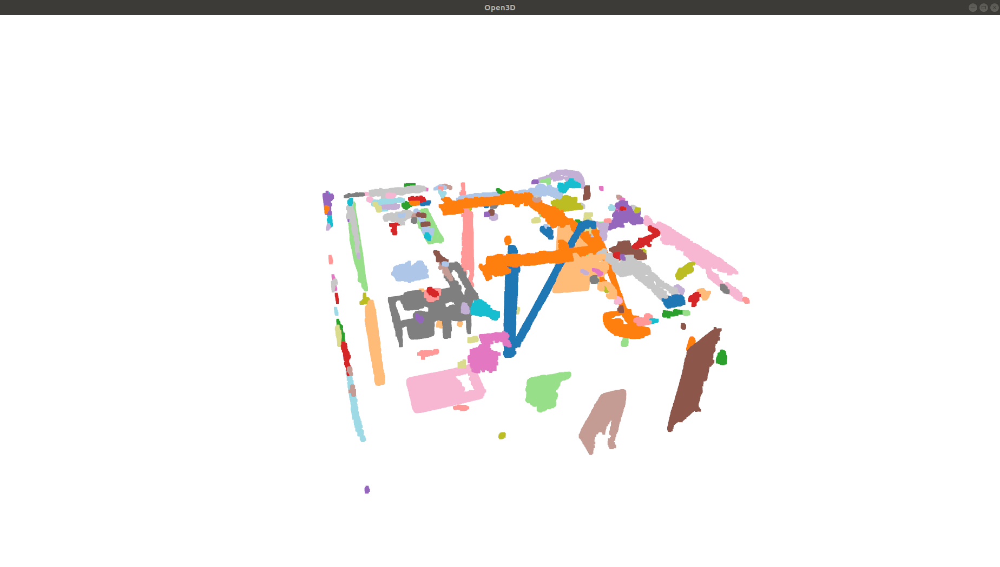

# indoor3d

Python package (indoor3d) for processing of indoors 3D. This package is built on top of the Open3D package, with the aim of making easier to perform common tasks that arise in indoor data processing. 

Open3D can load `.pcd` or `.ply` files, so let's suppose your file is `file.ply`.

Firt let's see the data with Open3D functionalities.

```python
>>> import open3d as o3d
>>> import numpy as np

>>> pcd_filename = "file.ply"
>>> pcd = o3d.io.read_point_cloud(pcd_filename)
>>> o3d.visualization.draw_geometries([pcd])
```


It is interesting to find the planes that delimit the floor and the ceiling, in order to remove some of the noise. To do do, the function `clusteringroom.get_ceiling_and_floor` takes the horizontal slices with a bigger number of points. 

```python
>>> import indoor3d.clusteringroom as clusteringroom
>>> data_pcd = clusteringroom.get_ceiling_and_floor(pcd, axis = 1, step = 0.01)
```
The *step* parameter is the thickness of the slice in meters. Therefore, in this case, we are taking all the slices that are 1 centimeter wide. *axis = 1* means the *Y* axis as the vertical axis, the axis to perform the sciling with.

The result is a named tuple with the fields *list_slice_values*, which are the maximum Y values of the bounding boxes of the slices, *cluster_1* and *cluster_2*, that are the values in the two clusters that have been assigned to the ceiling or floor (not particular order at this stage), and *ceiling_height* and *floor_height*, that are the estimated values of ceiling and floor from the clusters. As we are working with the maximum values of each slice, the value for the ceiling will be less than the values in its corresponding cluster, because we have to substract the width of the slice.

```python
>>> type(data_pcd)
indoor3d.clusteringroom.Data
>>> data_pcd._fields
('list_slice_values',
 'cluster_1',
 'cluster_2',
 'ceiling_height',
 'floor_height')
```

Now we have the ceiling and floor heights in these variables:

```python
>>> ceiling_pcd = data_pcd.ceiling_height
>>> floor_pcd = data_pcd.floor_height
```

We can call the `indoor3d.pointcloid.crop` function with those limits for Y, and for X and Z we could take the bounding limits of the pointcloud, not to have problems cropping too much.

```python
>>> import indoor3d.pointcloud as pointcloud
>>> max_x, _, max_z = pcd.get_max_bound()
>>> min_x, _, min_z = pcd.get_min_bound()
>>> envolvent_points = [[min_x, floor_pcd, min_x], [min_x, floor_pcd, max_x],
[min_x, ceiling_pcd, min_x], [min_x, ceiling_pcd, max_x],
[max_x, floor_pcd, min_x], [max_x, floor_pcd, max_x],
[max_x, ceiling_pcd, min_x], [max_x, ceiling_pcd, max_x]]
>>> pcd_cropped, _ = pointcloud.crop(pcd, envolvent_points)
>>> o3d.visualization.draw_geometries([pcd_cropped])
```



It may be helpful to try to find the plane models of the main room from a pointcloud of the zones with more points stacked in the vertical, which would correspond to the walls. We divide the space into cubic voxels of *edge* size. In this case the edge is two centimeters. Then we count the points in each voxel and remove all the voxels below some percentile. Here, as we take a 95 percentile, we only retain the 5% more populated voxels. This could be improved, for example, taking succesive voxels till we cover a 50% (for example) of the total of points.

```python
>>> points_in_voxels, new_pcd = pointcloud.count_points_in_voxel_in_x_and_z(pcd_cropped, edge = 0.02, percentile = 95)
>>> o3d.visualization.draw_geometries([new_pcd])
```



Then we look for the room plane models in the pointcloud that only contains areas with a lot of stacked points (95 percentile). As we already know the ceiling and floor heights, we pass them to the function, so it can compute the planes from those values. The parameter is *y_ceiling_floor = (ceiling_pcd, floor_pcd)*. The plane models are computed with a tolerance of 5 centimeters, which means that points at a distance less than 5 centimeters are supposed to be in the plane model.

```python
>>> import indoor3d.findroom as findroom
>>> _, _, _, plane_models = findroom.find_room_in_hololens_pointcloud(new_pcd, y_ceiling_floor = (ceiling_pcd, floor_pcd), distance_threshold = 0.05)
```

And then we use that information for finding the right *inside_room* pointcloud, as well as *raw_limits_room*, *limits_room* and *plane_models*. The *plane_thickness* to extract the *raw_limits_room* is counted twice, one for each side of the plane, so the real thickness is twice the parameter value.

```python
>>> inside_room, raw_limits_room, limits_room, plane_models = findroom.find_room_in_hololens_pointcloud(pcd_cropped, given_planes = plane_models, plane_thickness = 0.025)
```

We now have the inside of the room, that it is our main area of interest:
```python
>>> o3d.visualization.draw_geometries([inside_room])
```


We could also be interested in the plane models of the limits of the room. The walls are parallel in this way: *wall_1_1* is parallel to *wall_1_2* and *wall_2_1* is parallel to *wall_2_2*.

```python
>>> plane_models
{'ceiling': PlaneIndoor(A=0,B=1,C=0,D=-1.6500000000000001),
 'floor': PlaneIndoor(A=0,B=1,C=0,D=1.58),
 'wall_1_1': PlaneIndoor(A=0.9193654417039261,B=-0.0003007234883748154,C=-0.3934044917968385,D=-2.3722421485747436),
 'wall_1_2': PlaneIndoor(A=0.9196322194811005,B=-0.004112564704252882,C=-0.39275904534945905,D=4.606395688156964),
 'wall_2_1': PlaneIndoor(A=0.39080894794977217,B=-0.00022279017158160784,C=0.9204717902070285,D=12.230166918437128),
 'wall_2_2': PlaneIndoor(A=0.3971059014216207,B=0.006871868354826012,C=0.9177470678141315,D=5.272589200451403)}
```
Let find the clusters inside the room.

```python
>>> list_clusters = clusteringroom.clustering_pcd_return_pcd_clusters(inside_room, eps = 0.05, min_points = 100)
>>> o3d.visualization.draw_geometries(list_clusters)
```



We can also get some idea about the boundaries of the clusters:

```python
>>> list_clusters_painted = clusteringroom.paint_list_of_clusters(list_clusters)
>>> o3d.visualization.draw_geometries(list_clusters_painted)
```




## Creating Sphinx documentation

First of all, you have to install `sphinx`.

`pip3 install sphinx`

To create the documentation, got to the directory with the *index.rst* and *conf.py* and there just type

`make html`

and you will find the file `index.html` in the directory `_build/html`.


