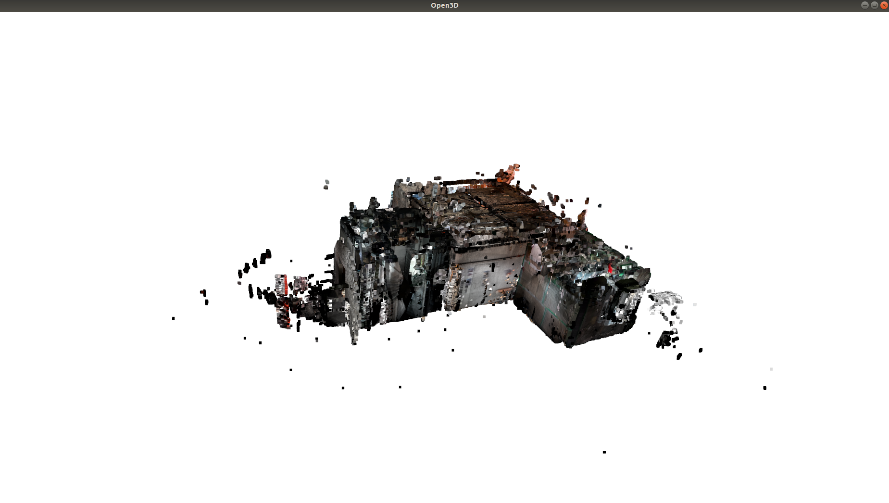

# indoor3d

Python package (indoor3d) for processing of indoors 3D. This package is built on top of the Open3D package, with the aim of making easier to perform common tasks that arise in indoor data processing. 

Open3D can load `.pcd` or `.ply` files, so let's suppose your file is `file.ply`.

Firt let's see the data with Open3D functionalities.

```python
>>> import open3d as o3d
>>> import numpy as np

>>> pcd_filename = `file.ply`
>>> pcd = o3d.io.read_point_cloud(pcd_filename)
>>> o3d.visualization.draw_geometries([pcd])
```



It is interesting to find the planes that delimit the floor and the ceiling, in order to remove some of the noise. To do do, the function `clusteringroom.get_ceiling_and_floor` takes the horizontal slices with a bigger number of points. 

```python
>>> import indoor3d.clusteringroom as clusteringroom
>>> data_pcd = clusteringroom.get_ceiling_and_floor(pcd, axis = 1, step = 0.01)
```
The *step* parameter is the thickness of the slice in meters. Therefore, in this case, we are taking all the slices that are 1 centimeter wide. *axis = 1* means the *Y* axis as the vertical axis, the axis to perform the sciling with.

The result is a named tuple with the fields *list_slice_values*, which are the maximum Y values of the bounding boxes of the slices, *cluster_1* and *cluster_2*, that are the values in the two clusters that have been assigned to the ceiling or floor (not particular order at this stage), and *ceiling_height* and *floor_height*, that are the estimated values of ceiling and floor from the clusters. As we are working with the maximum values of each slice, the value for the ceiling will be less than the values in its corresponding cluster, because we have to substract the width of the slice.

```python
>>> type(data_pcd)
indoor3d.clusteringroom.Data
>>> data_pcd._fields
('list_slice_values',
 'cluster_1',
 'cluster_2',
 'ceiling_height',
 'floor_height')
```

Now we have the ceiling and floor heights in these variables:

```python
>>> ceiling_pcd = data_pcd.ceiling_height
>>> floor_pcd = data_pcd.floor_height
```

We can call the `indoor3d.pointcloid.crop` function with those limits for Y, and for X and Z we could take the bounding limits of the pointcloud, not to have problems cropping too much.

```python
>>> max_x, _, max_z = pcd.get_max_bound()
>>> min_x, _, min_z = pcd.get_min_bound()
>>> envolvent_points = [[min_x, floor_pcd, min_x], [min_x, floor_pcd, max_x],
[min_x, ceiling_pcd, min_x], [min_x, ceiling_pcd, max_x],
[max_x, floor_pcd, min_x], [max_x, floor_pcd, max_x],
[max_x, ceiling_pcd, min_x], [max_x, ceiling_pcd, max_x]]
>>> pcd_cropped, _ = pointcloudrsait.crop(pcd, envolvent_points)
>>> o3d.visualization.draw_geometries([pcd_cropped])
```

## Creating Sphinx documentation

First of all, you have to install `sphinx`.

`pip3 install sphinx`

To create the documentation, got to the directory with the *index.rst* and *conf.py* and there just type

`make html`

and you will find the file `index.html` in the directory `_build/html`.


